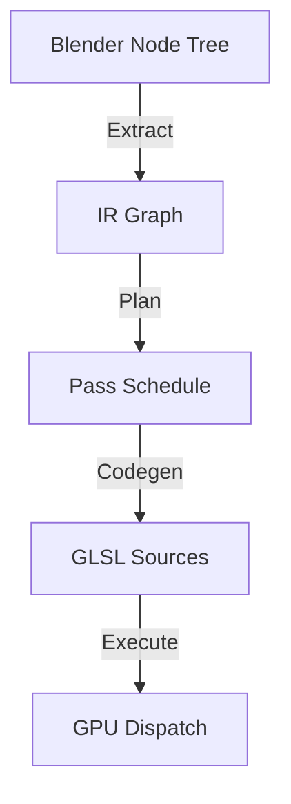

# Compute Nodes Architecture

> **Addon Version**: 0.2.0 (Refactored)
> **Date**: January 2026

This document describes the internal architecture of the Compute Nodes addon, a system for declaratively defining GPU compute shaders using Blender nodes.

---

## 1. High-Level Pipeline

The addon transforms a Blender node tree into executable GLSL compute shaders through a 4-stage pipeline:

### 1.1 Key Stages

1.  **Graph Extraction** (`compute_nodes.graph_extract`)
    -   Walks the node tree from outputs to inputs.
    -   Converts Blender nodes into an Intermediate Representation (IR).
    -   Handlers use `NodeContext` for type-safe property access.
    -   Resolves "Field" (lazy) vs "Grid" (materialized) data types.

2.  **Planning & Scheduling** (`compute_nodes.planner`)
    -   Analyzes the IR Graph for dependencies.
    -   Splits the graph into **Compute Passes** based on materialization points (`Capture` nodes).
    -   Handles loops (`Repeat Zone`) by creating `PassLoop` structures.
    -   Optimizes resource allocation (ping-pong buffers).

3.  **Code Generation** (`compute_nodes.codegen`)
    -   Converts each `ComputePass` into a GLSL shader string.
    -   Emitters use `ShaderContext` to generate code for each Op.
    -   Performs **Tree-Shaking**: Only includes necessary GLSL library functions.

4.  **Runtime Execution** (`compute_nodes.runtime`)
    -   Compiles GLSL shaders using `gpu.types.GPUShader`.
    -   Manages GPU textures (allocation, resizing).
    -   Dispatches compute groups based on grid size.

---

## 2. Core Concepts

### 2.1 Fields vs Grids

*   **Grid (HANDLE)**: A materialized texture in GPU memory. It has a defined resolution (W x H x D).
    *   Created by: `Image Input`, `Capture`, `Repeat Input` (for loop state).
    *   Represented as `DataType.HANDLE` in IR.
*   **Field (FLOAT/VEC3)**: A lazy mathematical expression evaluated per-pixel.
    *   Created by: `Math`, `Noise Texture`, `Combine XYZ`.
    *   Represented as scalar/vector types in IR.
    *   **Auto-Sampling**: When a Grid is connected to a Field socket, it is automatically sampled using normalized UVs.

### 2.2 The Intermediate Representation (IR)

The IR is an SSA (Static Single Assignment) graph located in `compute_nodes.ir`.

*   **`Graph`**: Container for Ops, Values, and Resources.
*   **`Op`**: A single operation (e.g., `ADD`, `SAMPLE`, `LOOP_START`).
*   **`Value`**: A typed data flow edge. Can be `SSA` (computed), `CONSTANT`, or `ARGUMENT` (uniform).
*   **`Resource`**: External data (Textures, Images) referenced by index.

---

## 3. Module Details

### 3.1 Graph Extraction (`graph_extract/`)

*   **`core.py`**: Main entry point (`extract_graph`). Handles recursion and cycle detection.
*   **`node_context.py`**: The API for node handlers.
    *   `ctx.input(name)`: Get raw value.
    *   `ctx.input_float(name)`: Get value with auto-cast.
    *   `ctx.builder`: Access to `IRBuilder` for emitting Ops.
*   **`handlers/`**: implementation of logic for specific nodes.
    *   *Example*: `math_ops.py` converts `NodeMath` to `OpCode.ADD`, `SUB`, etc.

### 3.2 Code Generation (`codegen/`)

*   **`glsl.py`**: The `ShaderGenerator` class. Orchestrates the generation of `main()`, uniforms, and headers.
*   **`shader_context.py`**: The API for GLSL emitters.
    *   `ctx.param(val)`: Resolves an IR Value to a GLSL string (e.g., `v1`, `img_0`, `3.14`).
    *   `ctx.lhs`: The left-hand side variable name for the current op result.
*   **`emitters/`**: GLSL generation logic for each `OpCode`.
    *   *Example*: `arithmetic.py` emits `float v3 = v1 + v2;`.

---

## 4. Development Guide

### Adding a New Node

1.  **Define Node**: Create `compute_nodes/nodes/my_node.py`.
2.  **Register Handler**: Add function in `compute_nodes/graph_extract/handlers/my_handler.py` and register in `graph_extract/registry.py`.
    *   Use `NodeContext` to read inputs and emit IR Ops.
3.  **Define OpCode** (if needed): Add to `compute_nodes/ir/ops.py`.
4.  **Register Emitter**: Add function in `compute_nodes/codegen/emitters/my_emitter.py` and register in `codegen/emitters/registry.py`.
    *   Use `ShaderContext` to write GLSL.

### Debugging

*   **Logging**: Logs are written to the System Console.
    *   Enable: `compute_nodes.operators.execute_compute_tree` initializes logging.
*   **Tests**: Run strict unit tests:
    *   `python -m pytest tests/` (requires `bpy` mock or Blender environment).
