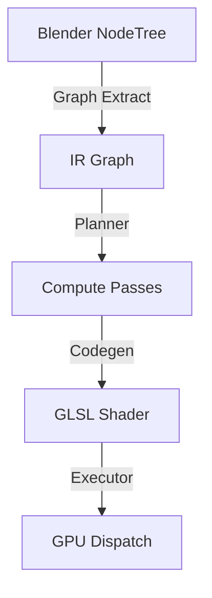

# Compute Nodes Architecture

> **System Overview**: Compute Nodes allows users to build GPU compute shaders visually in Blender. The pipeline transforms a Blender Node Tree into a GLSL Compute Shader executed via the `gpu` module.

---

## 1. Core Pipeline

### Phase 1: Graph Extraction
**Input:** `compute_nodes.ComputeNodeTree`
**Output:** `compute_nodes.ir.graph.Graph`

- **Handlers**: Modular functions convert specific Blender nodes into IR operations.
- **Auto-Sampling**: Automatically injects `SAMPLE` ops when a Grid connects to a Field input.
- **Module:** `compute_nodes.graph_extract`

### Phase 2: Planning & Scheduling
**Input:** `compute_nodes.ir.graph.Graph`
**Output:** List of `ComputePass`

- **Hazard Detection**: Splits passes when a resource is read after being written (RAW hazard).
- **Loop Handling**: Identifies `PassLoop` regions for iterative execution.
- **Dispatch Calculation**: Determines the compute grid size (X, Y, Z) for each pass.
- **Module:** `compute_nodes.planner`

### Phase 3: Code Generation
**Input:** `ComputePass`
**Output:** GLSL Source Code

- **Emitters**: Small functions that emit GLSL code strings for specific OpCodes.
- **Registry**: Maps OpCodes to Emitter functions.
- **Shader Lib**: Standard library of GLSL helper functions (noise, math, etc.).
- **Module:** `compute_nodes.codegen`

### Phase 4: Runtime Execution
**Input:** GLSL Source + Resources
**Output:** Blender Image / GPU Texture

- **Resource Resolution**: Maps IR `ImageDesc` to actual `gpu.types.GPUTexture`.
- **Execution Loop**: Iterates through passes, binding resources and dispatching compute groups.
- **Ping-Pong**: Manages double-buffering for iterative loops.
- **Module:** `compute_nodes.runtime`

---

## 2. Key Concepts

### Fields vs. Grids
- **Field**: A value calculated *per-pixel* (lazy evaluation). Compiles into the main shader body.
- **Grid**: A materialized buffer in VRAM. Requires a `Capture` node to write, and a `Sample` node to read.

### Intermediate Representation (IR)
The IR is an SSA (Static Single Assignment) graph.
- **Value**: A typed piece of data (Float, Vec3, handle, etc.).
- **Op**: An operation applied to Values (ADD, SAMPLE, IMAGE_STORE).
- **Block**: A sequence of Ops.

### Resource Management
- **ImageDesc**: Description of a texture (resolution, format).
- **ResourceAccess**: Tracks if a resource is READ, WRITE, or READ_WRITE in a pass.

---

## 3. Directory Structure

| Path | Responsibility |
|------|----------------|
| `compute_nodes/nodes/` | Blender UI definition of nodes |
| `compute_nodes/graph_extract/` | Blender Nodes -> IR conversion logic |
| `compute_nodes/ir/` | Core graph data structures (Graph, Value, Op) |
| `compute_nodes/planner/` | Pass splitting and scheduling logic |
| `compute_nodes/codegen/` | GLSL generation |
| `compute_nodes/runtime/` | GPU execution and texture management |
